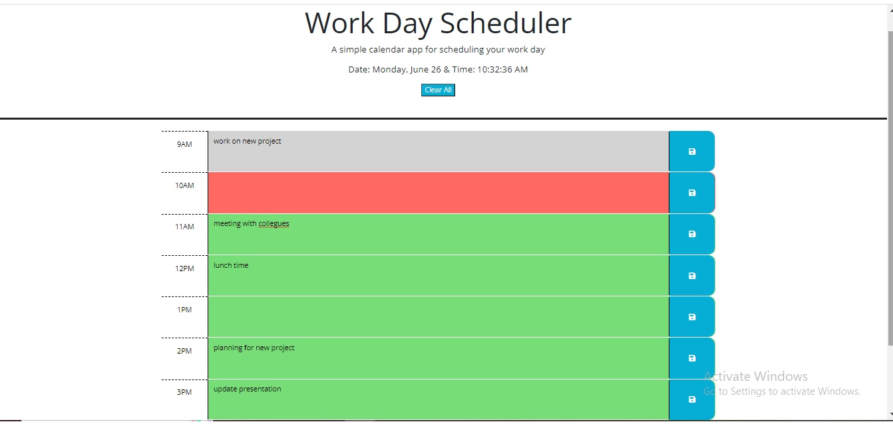

# 05 Third-Party APIs: Work Day Scheduler

## Description

The Work Day Schedular to plan day to day activities. It allows a user to save events for each hour of a typical working day and increases the efficency for busy days. It helps in tracking past, present and future events. As grey indicates past, red indicates present and green indicates future. This app will run in the browser and feature dynamically updated HTML and CSS powered by jQuery.

You'll need to use the [Day.js](https://day.js.org/en/) library to work with date and time. Be sure to read the documentation carefully and concentrate on using Day.js in the browser.

## User Story

```md
AS AN employee with a busy schedule
I WANT to add important events to a daily planner
SO THAT I can manage my time effectively
```

## Acceptance Criteria

```md
GIVEN I am using a daily planner to create a schedule
WHEN I open the planner
THEN the current day is displayed at the top of the calendar
WHEN I scroll down
THEN I am presented with timeblocks for standard business hours of 9am&ndash;5pm
WHEN I view the timeblocks for that day
THEN each timeblock is color coded to indicate whether it is in the past, present, or future
WHEN I click into a timeblock
THEN I can enter an event
WHEN I click the save button for that timeblock
THEN the text for that event is saved in local storage
WHEN I refresh the page
THEN the saved events persist
```
## Mock-up
The following animation demonstrates the application functionality:


## Screenshot


## URL of deployed application
https://sakshiarora04.github.io/Work-Day